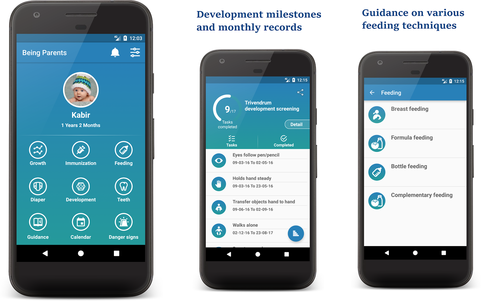

Being Parents (Baby Care) 

General guidelines for parents of newborn to 6 years old.
Monitor vital parameters through this app.

Growth
Standardized growth Charts from WHO helps you track your baby's growth(weight, height and head circumference).

Immunization
Get vaccination schedule as suggested by IAP immunization guidelines 
Get reminders for upcoming vaccines.
Add date to every vaccine when administered for easy record maintainence.

Development assessment
Manage important activities and task that should be completed by an infant in a given time frame.
Inegrated Trivandrum developmental screening chart for easy understanding of activity and dates.

Calender
Save all the memorable events in calendar. Add images to every event. 
Just take a snap and add a title. That's it, memory saved.
Also add doctor's visits, prescriptions, crucial investigations and maintain illness record. Access at finger tips.

Teeth
Learn teeth eruption schedule in the easiest way.

Guidance
Baby caring guidelines and tips. Learn every possible way to make your baby healthy. 
Includes tips on bathing, handling the baby, massage and other vital process.

Nutrition
Directions on what and how to feed the baby. Includes guidance on suplementary and breast feeding and 

Danger signs
IMNCI guidelines to help you identify different signs which warrant urgent visit to doctor.
This also guide for use of diaper.

